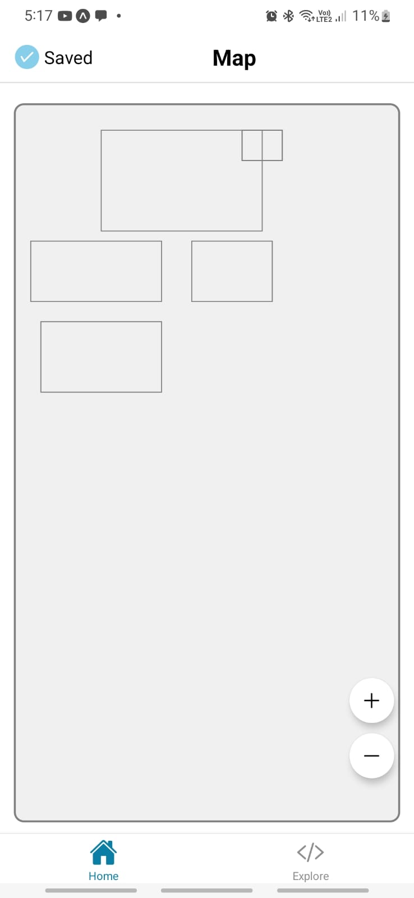

## MapScreen Component

The `MapScreen` component is a React Native screen that displays an interactive, `zoomable` map with labeled areas. Users can tap on areas to view more information and use buttons to zoom in or out.

### Features

- **Interactive Map**: Users can tap on areas to view more information.
- **Zoomable Map**: Users can zoom in or out using buttons.
- **Labeled Areas**: Areas are labeled with names and descriptions.
- **Buttons**: Zoom in and out buttons are provided for user convenience.
- **Customizable**: The map can be customized with different map styles and colors.
- **Accessibility**: The component is designed with accessibility in mind, providing a good user experience for users

### Installation

To use the `MapScreen` component, you need to install the required dependencies. Run the following

#### REACT NATIVE CLI

```bash
npm install react-native-svg react-native-modal react-native-safe-area-context
npm install react-native-gesture-handler react-native-reanimated
```

#### EXPO CLI

```
expo install react-native-svg react-native-gesture-handler react-native-reanimated
expo install react-native-modal react-native-safe-area-context

```


